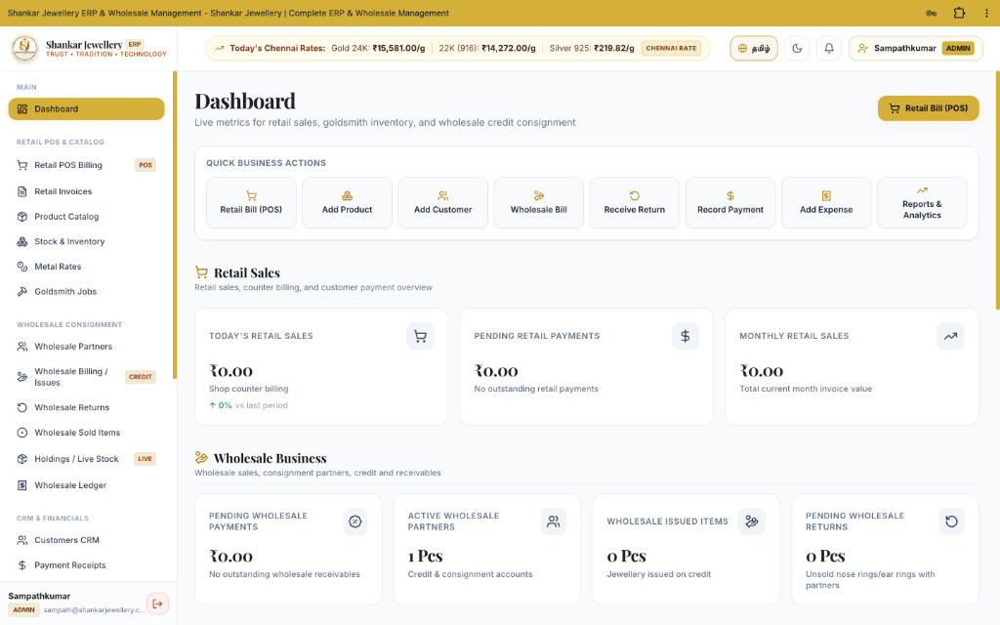
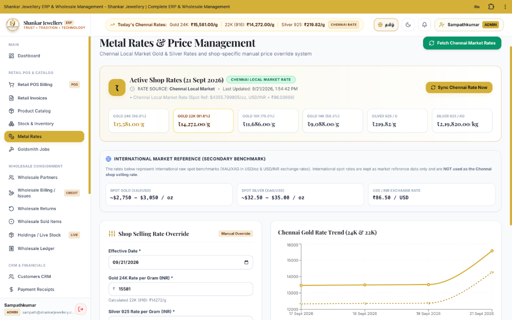
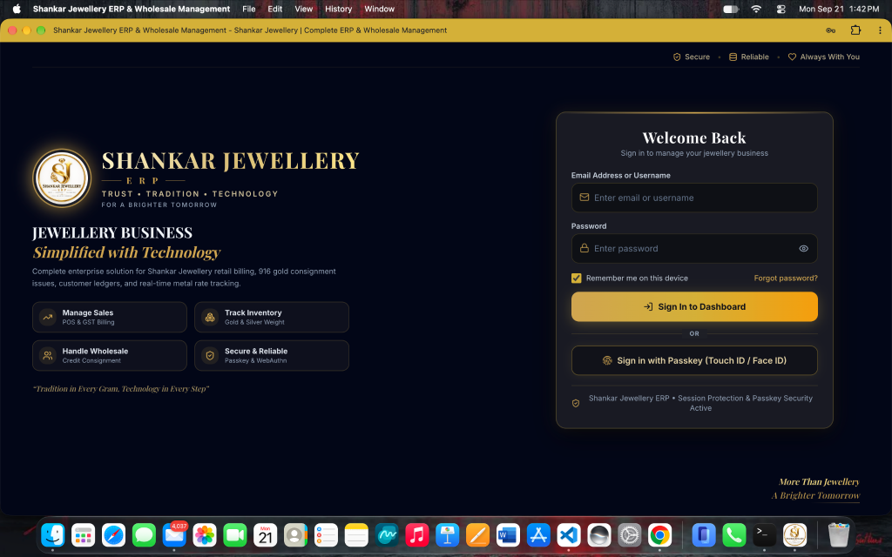
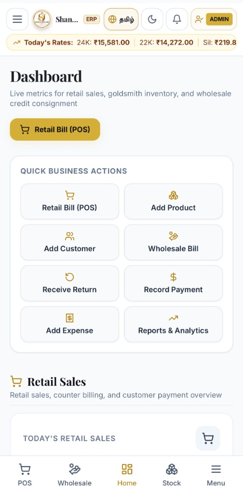
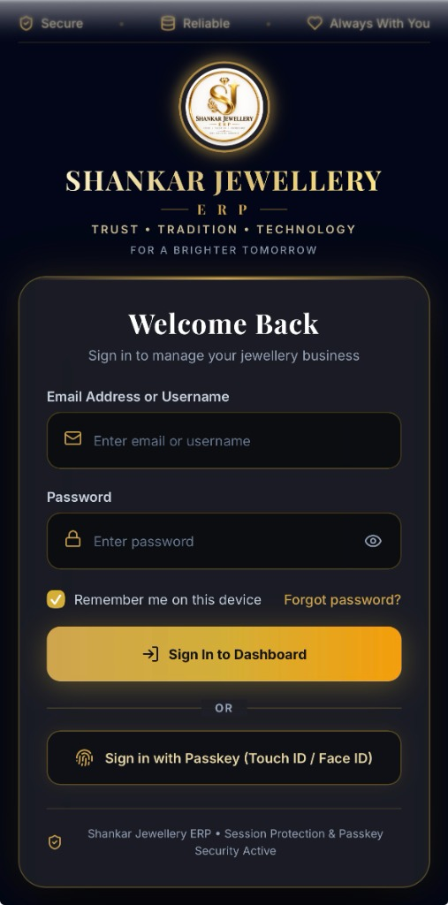
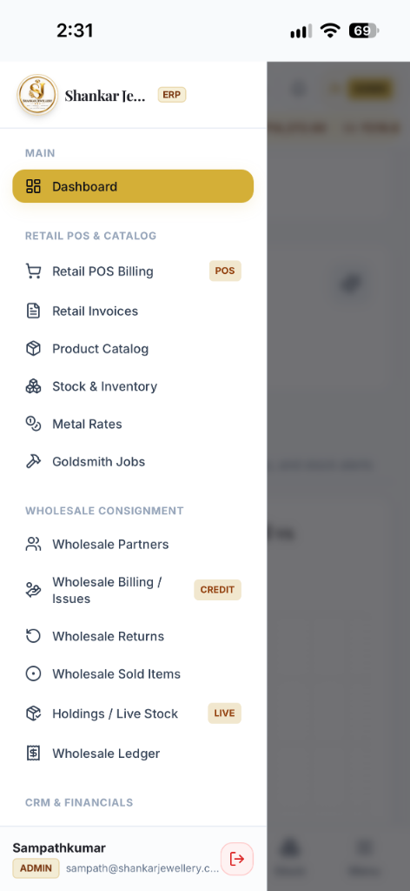
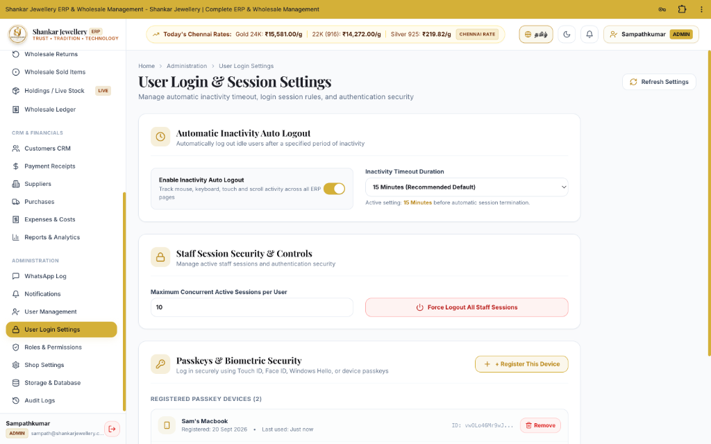
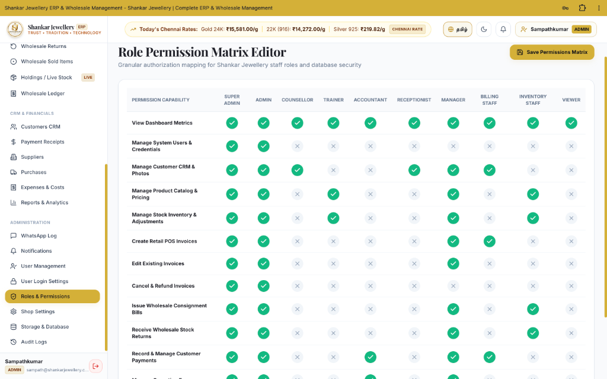
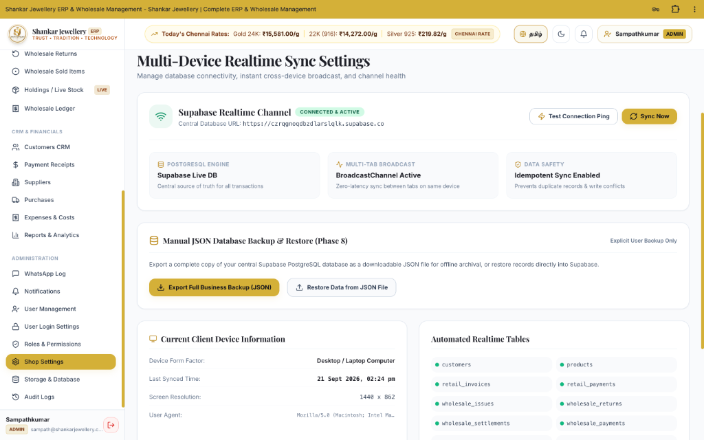

# 💎 Shankar Jewellery ERP

> A modern, responsive ERP platform designed to manage jewellery retail, inventory, billing, customers, wholesale operations, business analytics, and administration from a centralized system.

[](https://shankar-jewellery-erp.vercel.app/)
[](https://github.com/Sampathjai/Jewellery-ERP)
[](https://www.typescriptlang.org/)
[](https://react.dev/)
[](https://tailwindcss.com/)
[](https://supabase.com/)

---

## 💎 Project Overview

**SHANKAR JEWELLERY ERP** is a full-featured digital enterprise management platform built specifically for jewellery retailers, goldsmith workshops, and wholesale consignment businesses.

The system centralizes end-to-end operational workflows into a unified, high-performance web and mobile web application:

* **🛒 Retail POS & Billing**: Counter billing, GST calculations, automatic stock adjustments, and custom vector PDF invoice generation with native WhatsApp sharing.
* **📦 Product & Inventory Catalog**: Real-time tracking of net weight, gross weight, wastage percentage, making charges, purity (24K, 22K/916, 18K, 925 Silver), and minimum stock threshold alerts.
* **🤝 Wholesale Consignment Management**: Issue items on credit consignment, track unsold returns, calculate profit-sharing models, and reconcile customer ledgers.
* **💰 Chennai Local Market Metal Rates**: Real-time 24K, 22K (916), and Silver local market rate ticker with shop override options and fallback protection.
* **👥 Customer CRM & Suppliers**: Customer database with credit limit tracking, purchase histories, agreed profit models, and refinery supplier ledgers.
* **📈 Reports & Analytics**: Financial overview metrics, retail/wholesale revenue breakdown, expense logging, net profit analysis, and PDF exports.
* **🔐 Enterprise Security & RBAC**: Granular Role-Based Access Control (10 staff roles), Passkey/WebAuthn biometric authentication (Touch ID / Face ID / Windows Hello), automatic inactivity timeout, and multi-session controls.
* **🔄 Multi-Device Realtime Synchronization**: Live cross-device synchronization powered by Supabase Realtime Channels with JSON database backup/restore capabilities.

---

## 🌐 Live Demo & Repository

| Metric | Link |
|---|---|
| **Live Deployment** | [https://shankar-jewellery-erp.vercel.app/](https://shankar-jewellery-erp.vercel.app/) |
| **GitHub Repository** | [https://github.com/Sampathjai/Jewellery-ERP](https://github.com/Sampathjai/Jewellery-ERP) |
| **Platform Host** | Vercel Cloud Platform |
| **Backend Engine** | Supabase Cloud Database & Auth Engine |

---

## 📸 Application Showcase

### 📊 Dashboard & Retail Overview
The central dashboard provides real-time financial metrics, daily counter billing totals, outstanding retail dues, pending wholesale consignment returns, and category stock distributions.

<table>
<tr>
<td width="50%">

<p align="center"><b>Desktop Dashboard View</b></p>
</td>
<td width="50%">

<p align="center"><b>Responsive Mobile Dashboard & Bottom Navigation</b></p>
</td>
</tr>
</table>

---

### 🔑 Authentication & Passkey Security
Translucent glassmorphism login interface featuring dual-mode authentication: traditional password login and native **WebAuthn Passkey (Touch ID / Face ID / Windows Hello)** biometric login.

<table>
<tr>
<td width="50%">

<p align="center"><b>Desktop Glassmorphism Login Interface</b></p>
</td>
<td width="50%">

<p align="center"><b>Mobile Passkey Login Interface</b></p>
</td>
</tr>
</table>

---

### 📱 Responsive Mobile Workflows & Navigation Drawer

<table>
<tr>
<td width="50%">

<p align="center"><b>Mobile Dashboard & Bottom Navigation Bar</b></p>
</td>
<td width="50%">

<p align="center"><b>Mobile Navigation Drawer Menu</b></p>
</td>
</tr>
</table>

---

### 💰 Metal Rates & Session Control

<table>
<tr>
<td width="50%">

<p align="center"><b>Chennai Local Market Gold & Silver Rates</b></p>
</td>
<td width="50%">

<p align="center"><b>Staff Inactivity Timeout & Passkey Registration</b></p>
</td>
</tr>
</table>

---

### 🛡️ Granular Role-Based Access Control (RBAC) & Realtime Synchronization

<table>
<tr>
<td width="50%">

<p align="center"><b>Granular 10-Role Permission Matrix Editor</b></p>
</td>
<td width="50%">

<p align="center"><b>Supabase Realtime Channel & JSON Backup Engine</b></p>
</td>
</tr>
</table>

---

## 💡 About The Project & Problem Solved

Traditional jewellery store management presents unique operational challenges that standard retail software fails to address:

1. **Complex Metal Weight Calculations**: Items require tracking gross weight, deduction weight (stones/beads), net metal weight, wastage percentage, making charges (per gram / per piece), and purity touches (24K, 22K/916, 18K, 925 Silver).
2. **Volatile Daily Metal Rates**: Billing requires real-time local market metal rates (such as published Chennai jewellery market rates) rather than unadjusted raw international spot rates.
3. **Wholesale Credit Consignment**: Wholesale partners receive jewellery on consignment (credit issues). Settlements depend on profit-sharing formulas, fine gold returns (916 gold payments), or cash valuation adjustments.
4. **Multi-Role Security Requirements**: Billing staff, inventory managers, accountants, and showroom staff require strictly scoped permissions to prevent unauthorized price overrides, invoice cancellations, or financial record alterations.

**Shankar Jewellery ERP** solves these challenges by combining complex precious metal billing math, real-time local market rate syncing, wholesale credit accounting, and enterprise-grade role permissions into a single, intuitive interface.

---

## 🛠️ Technology Stack

### Frontend Core
* **React 18** (`18.3.1`) — Component-based UI framework
* **TypeScript** (`5.6.3`) — Strict type safety across all domain models
* **Vite** (`5.4.9`) — Fast build tool and module bundler
* **Tailwind CSS** (`3.4.14`) — Utility-first styling with custom luxury gold palettes (`gold-400`, `charcoal-900`, etc.)
* **Lucide React** (`0.453.0`) — Modern vector icons

### State & Forms & Data
* **React Router DOM** (`6.27.0`) — Client-side routing with protected route guards
* **React Hook Form** (`7.53.1`) & **Zod** (`3.23.8`) — Declarative form validation
* **Recharts** (`3.10.1`) — Interactive business analytics charts (Sales trend, category mix, purchase history)
* **jsPDF** (`2.5.2`) & **jsPDF-AutoTable** (`3.8.3`) — Client-side vector PDF invoice generation and WhatsApp share engine

### Backend & Infrastructure
* **Supabase Client** (`2.45.4`) — Realtime database subscription, authentication, and remote PostgreSQL backend
* **Vercel** — Automated CI/CD deployment platform

---

## 📁 System Architecture

```text
  ┌─────────────────────────────────────────────────────────────┐
  │                 React 18 + TypeScript Client               │
  │  (Responsive Desktop & Mobile PWA / Web Application)        │
  └──────────────────────────────┬──────────────────────────────┘
                                 │
     ┌───────────────────────────┼───────────────────────────┐
     │                           │                           │
┌────▼─────────────┐   ┌─────────▼─────────┐   ┌─────────────▼────┐
│ Protected Routes │   │ Local Sync Engine │   │ Profit & Billing │
│  & Role Guard    │   │ & LocalStorage    │   │ Math Engine      │
└────┬─────────────┘   └─────────┬─────────┘   └─────────────┬────┘
     │                           │                           │
     └───────────────────────────┼───────────────────────────┘
                                 │
  ┌──────────────────────────────▼──────────────────────────────┐
  │                 Supabase Realtime Engine                    │
  │     (PostgreSQL Database, WebAuthn Auth, RLS Policies)       │
  └─────────────────────────────────────────────────────────────┘
```

---

## 📑 Module Breakdown

| Module Name | Route Path | Core Capabilities & Business Purpose |
|---|---|---|
| **Dashboard** | `/dashboard` | Live financial summary, counter sales, pending dues, wholesale returns alert, category share pie chart. |
| **Retail POS Billing** | `/pos` | Quick customer counter billing, item weight deduction, wastage & making charge math, instant invoice generation. |
| **Retail Invoices** | `/invoices` | Complete history of retail sales, invoice status (Paid/Partial/Unpaid), cancellation, native "Share as PDF" workflow. |
| **Product Catalog** | `/products` | Inventory management, SKU/barcode lookup, net weight, purity touch, stock quantity, minimum stock threshold alerts. |
| **Stock Movements** | `/stock-movements` | Detailed audit log of stock entries, purchases, sales, wholesale issues, returns, and manual adjustments. |
| **Metal Rates** | `/metal-rates` | Published Chennai Local Market gold (24K, 22K, 18K) & silver (925) rates ticker, manual shop override, international spot reference. |
| **Wholesale Consignment** | `/wholesale-issues` | Consignment billing for wholesale partners, credit item tracking, fine gold valuation, 916 gold payment reconciliation. |
| **Wholesale Ledger** | `/wholesale-ledger` | Outstanding credit balances per partner, automated payment allocation, customer ledger history. |
| **Wholesale Returns** | `/wholesale-returns` | Receiving unsold consignment items back into showroom stock with automatic inventory increment. |
| **Goldsmith Jobs** | `/manufacturing` | Workshop job cards, raw metal issue weight, finished ornament weight, goldsmith wastage calculations. |
| **Customer CRM** | `/customers` | Customer database, agreed profit sharing models (Model A/B/C), credit limits, photo documentation. |
| **Suppliers & Purchases** | `/suppliers`, `/purchases` | Refinery & supplier purchase records, raw metal stock entries, supplier payment tracking. |
| **Expenses** | `/expenses` | Shop operational costs (Rent, electricity, wages, maintenance) for net profit calculation. |
| **Reports & Analytics** | `/reports` | Comprehensive financial reporting, sales trend graphs, profit margins, GST estimates, PDF report export. |
| **User Management** | `/users` | Staff account creation, role assignment, active/inactive status toggle. |
| **Role Permissions** | `/roles-permissions` | Granular 10-role authorization matrix editor mapping permissions across all system modules. |
| **User Login Settings** | `/admin/user-login-settings` | Automatic inactivity timeout settings (15/30/60 mins), session count limits, WebAuthn Passkey device registration. |
| **Storage & Database** | `/admin/storage-database` | Supabase Realtime Channel status, connection ping, full JSON database backup export & restore. |
| **Audit Logs** | `/audit-logs` | Immutable audit trail tracking user actions, entity modifications, and security events. |

---

## 👥 Staff Roles & Access Control Matrix

The ERP implements a granular Role-Based Access Control (RBAC) engine supporting 10 distinct staff roles:

1. **Super Admin**: Full unrestricted access to system configuration, security, database backup, and user management.
2. **Admin**: Complete business operational access across billing, inventory, wholesale, reports, and staff settings.
3. **Manager**: Management of sales, inventory adjustments, customer credit limits, and wholesale issues.
4. **Accountant**: Financial tracking, payment receipts, expense logging, supplier purchases, and reporting.
5. **Billing Staff**: Retail counter POS billing, customer invoice lookup, payment collection, and PDF printing/sharing.
6. **Inventory Staff**: Product catalog entry, weight adjustments, stock transfers, and minimum stock monitoring.
7. **Counsellor**: Customer onboarding, CRM management, and sales inquiry tracking.
8. **Trainer**: Staff guidance and read-only operational walkthrough access.
9. **Receptionist**: Counter customer check-in, basic inquiry lookup, and visitor logging.
10. **Viewer**: Read-only oversight for business metrics.

---

## 🔑 Authentication & Security Architecture

* **Dual-Mode Login**: Traditional password authentication alongside **W3C WebAuthn / Passkeys** for instant biometric login (Touch ID, Face ID, Windows Hello).
* **Automatic Inactivity Logout**: Client-side activity monitoring (mouse, keyboard, touch, scroll) automatically logs out idle sessions after a configurable timeout (default: 15 minutes).
* **Concurrent Session Controls**: Restricts the maximum active sessions per user account with a global "Force Logout All Staff Sessions" override.
* **Granular Route Protection**: Client-side React Router navigation guards verify session state and active role permissions before mounting page components.
* **Environment Protection**: Sensitive database keys (`VITE_SUPABASE_ANON_KEY`) are managed strictly via environment configuration files.

---

## 🔧 Local Development & Installation

### Prerequisites
* **Node.js**: v18.0.0 or higher
* **pnpm** or **npm**: v9.0.0+ or v10.0.0+
* **Supabase Project**: A valid Supabase project with PostgreSQL instance

### 1. Clone Repository
```bash
git clone https://github.com/Sampathjai/Jewellery-ERP.git
cd Jewellery-ERP
```

### 2. Install Dependencies
```bash
npm install
```

### 3. Configure Environment Variables
Create a `.env` file in the root directory based on `.env.example`:
```env
VITE_SUPABASE_URL=https://your-project-id.supabase.co
VITE_SUPABASE_ANON_KEY=your-actual-supabase-anon-key
VITE_SUPABASE_PUBLISHABLE_KEY=your-actual-supabase-anon-key
```

### 4. Database Setup (Supabase)
Execute the database schema script located at `supabase/schema_full.sql` inside your Supabase SQL Editor to provision tables, indexes, triggers, and default seed data.

### 5. Start Development Server
```bash
npm run dev
```
Open your browser at `http://localhost:5173`.

### 6. Build for Production
```bash
npm run build
```
The optimized production build output will be generated in the `dist/` directory.

---

## 📄 License

This repository is maintained for demonstration and portfolio case-study purposes. All rights reserved by **Shankar Jewellery ERP**.

---

<p align="center">
  <b>💎 Shankar Jewellery ERP &bull; Trust &bull; Tradition &bull; Technology</b><br/>
  <i>For a Brighter Tomorrow</i>
</p>

